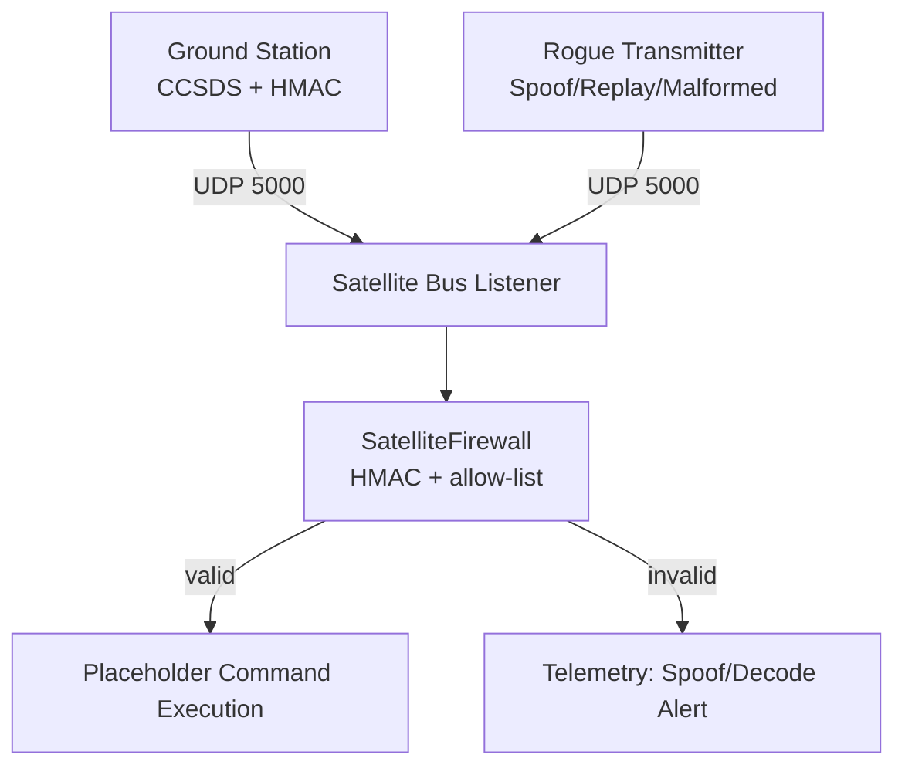

# LEO Satellite Uplink "Command Intrusion" Simulator

A production-style Python lab that demonstrates how authenticated CCSDS uplink commands can defeat spoofing attempts against a low-Earth-orbit (LEO) satellite bus. The repository models a legitimate ground station, a hardened satellite command bus, and a rogue transmitter designed to exercise the defences.

## Why this exists

- **Uplink spoofing** occurs when an adversary transmits unauthorized commands that masquerade as coming from a trusted ground station.
- **HMAC authentication** provides integrity and authenticity for command packets, preventing unauthorized control even if an attacker can reach the RF link.
- **CCSDS framing** models real-world spacecraft command formats, including primary and secondary headers that carry timestamps and ground identifiers.

## Repository structure

```
./ground/            Legitimate command generation and UDP transmission
./satellite/         Satellite bus listener, firewall, and telemetry logging
./attacker/          Rogue transmitter for spoofing and malformed traffic
./crypto/            HMAC-SHA256 signing and verification primitives
./ccsds/             Packet builder, parser, and field definitions using ccsdspy
./utils/             Shared helpers (HMAC key resolution)
./cli/               satcli wrapper for launching components
./examples/          Sample packet metadata
./tests/             Pytest coverage for HMAC and CCSDS flows
./docs/              Architecture and API notes
```

## Architecture diagram



## Setup

```bash
python -m venv .venv
source .venv/bin/activate
pip install -r requirements.txt
```

> Provide a strong secret via `SATCOM_KEY` or the `--key` flag. A demo fallback exists for local experimentation and is not suitable for production-like testing.

## Running the simulation

### Start the satellite bus
```bash
python -m satellite.satellite_bus --allowed-ground-stations GS-ALPHA GS-BETA --host 127.0.0.1 --port 5000 --key "$SATCOM_KEY"
```

### Send a legitimate command
```bash
python -m ground.ground_station "CMD: ORIENT +10" --ground-id GS-ALPHA --host 127.0.0.1 --port 5000 --key "$SATCOM_KEY"
```

### Attempt an attack
```bash
# Spoof a command with an incorrect key
python -m attacker.rogue_transmitter spoof "CMD: SHUTDOWN_THRUSTERS" --ground-id GS-ALPHA

# Send malformed binary junk
python -m attacker.rogue_transmitter malformed

# Replay a captured packet
python -m attacker.rogue_transmitter replay "<hex-encoded-packet>"
```

### Unified CLI wrapper
```bash
python -m cli.satcli bus --host 0.0.0.0 --port 5000 --allowed-ground-stations GS-ALPHA
python -m cli.satcli send "CMD: ORIENT +10" --ground-id GS-ALPHA --key "$SATCOM_KEY"
python -m cli.satcli attack spoof --command "CMD: RESET_COMPUTER"
```

## Telemetry examples

Accepted command:
```
2024-01-01T00:00:00Z | INFO | {"message": "Command accepted", "command": "CMD: ORIENT +10", "ground_station_id": "GS-ALPHA"}
```

Spoof attempt:
```
2024-01-01T00:00:01Z | CRITICAL | {"message": "CRITICAL SECURITY ALERT: Uplink Spoof Attempt Detected", "ground_station_id": "GS-ALPHA", "command": "CMD: SHUTDOWN_THRUSTERS"}
```

## Security and configuration

- **Shared secret**: Supply via `SATCOM_KEY` or `--key`. Using the built-in demo key triggers a warning and should only be used for local walkthroughs.
- **Ground allow-list**: Configure authorized IDs with `--allowed-ground-stations` on `satellite_bus.py`.
- **Packet format**: Primary and secondary headers follow CCSDS-style layouts defined in `ccsds/packet_builder.py` and `ccsds/packet_parser.py` using `ccsdspy.PacketField` definitions.
- **Telemetry**: Structured JSON emitted to both stdout and `telemetry.log` for easy parsing.

## Testing, linting, and typing

```bash
pytest
ruff check .
black --check .
mypy .

# or run everything
make ci
```

Install local git hooks for the same checks:

```bash
pre-commit install
pre-commit run --all-files
```

## Documentation

- [Architecture overview](docs/ARCHITECTURE.md)
- [API reference](docs/API.md)
- [Operations runbook](docs/OPERATIONS.md)
- [Examples](examples/)

## Contributing

Please see [CONTRIBUTING.md](CONTRIBUTING.md), [CODE_OF_CONDUCT.md](CODE_OF_CONDUCT.md), and [SECURITY.md](SECURITY.md) for contribution, conduct, and disclosure guidance.

## License

[MIT](LICENSE)
